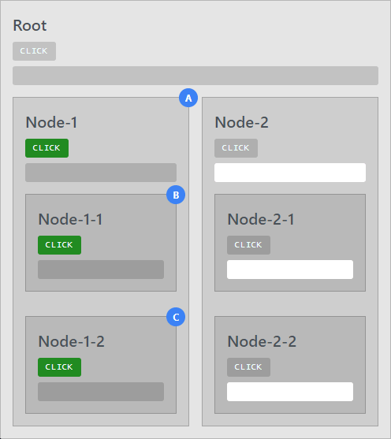

# Angular OnPush Strategy

Visual examples representing Angular change detection with OnPush strategy.  
:link: [live app](https://mmustra.github.io/angular-on-push-strategy)

  

  &nbsp;&nbsp;&nbsp;
  &nbsp;&nbsp;&nbsp;
  &nbsp;&nbsp;&nbsp;
  

## Table of Contents

- [About](#about)
- [Usage](#usage)
- [Features](#features)
- [Technologies](#technologies)
- [Development](#development)

## About 

It is a playground for improving understanding of change detection and the OnPush strategy. In the future this project may be extended with additional examples or strategies.

## Usage 

After you run application:

1. Open Console from DevTools
2. Click on app tabs, tryout examples

Example will show animation and logs. You can reload the example and change the speed of animation. Every button click in example will reset the animation/logs.

## Features 

- Standalone components
- Dynamic components
- Portal components
- Content projection
- Directive composition
- Dependency providers
- Resolution modifiers

## Technologies 

- Angular 16
- Primeng
- RxJS
- Tailwind
- ngneat/overview
- Lodash

## Development 

This project was generated with [Angular CLI](https://github.com/angular/angular-cli) version 16.2.1.

Run `npm start` for a dev server. Navigate to `http://localhost:4200/`. The app will automatically reload if you change any of the source files.

#### IDE

[Visual Studio Code](https://code.visualstudio.com/) is recommended. [Prettier](https://prettier.io/) is used as formatter for the project.

#### Code style

Be sure to follow current folder structure and code style in the project. Use Typescript to create better code environment with your contributions. Before adding new packages to project be sure to first check `package.json` for possible duplicates.

For generating new angular components use `ng generate`.  
Example: `ng generate component component-name`

You can also use `ng generate directive|pipe|service|class|guard|interface|enum|module`. To get more help on the Angular CLI use `ng help` or go check out the [Angular CLI README](https://github.com/angular/angular-cli/blob/master/README.md).

#### Scripts

##### Serve

Run `ng serve` to serve the project. Use the `--prod` flag for a production build.

##### Build

Run `ng build` to build the project. The build artifacts will be stored in the `dist/` directory. Use the `--prod` flag for a production build.

##### Running unit tests

Run `ng test` to execute the unit tests via [Karma](https://karma-runner.github.io).

##### Running end-to-end tests

Run `ng e2e` to execute the end-to-end tests via [Protractor](http://www.protractortest.org/).

## License

The MIT License ([MIT](./LICENSE))  
Copyright (c) 2023, Marin Muštra
